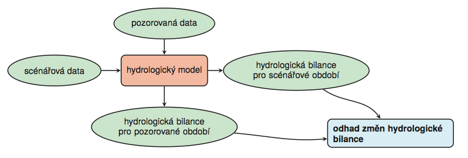

```{r, include = FALSE}
knitr::opts_chunk$set(
  collapse = TRUE,
  prompt = TRUE,
  comment = "# "
)
```


## Zadání projektu

> **Pro vybrané povodí zjistěte očekávané změny hydrologické bilance v měsíšním kroku a vyhodnoťte účinek opatření v podobě zvýšení/snížení retence půdy o 50 % na ukazatele hydrologického sucha**.


- pro ulehčení projektu byl vytvořen balík `KZ2020`, který obsahuje veškerá data potřebná pro zpracování projektu
- balík je možno stáhnout [ZDE](ZDE)
- toto zadání je přístupné zároveň po nainstalování balíku KZ2020 příkazem `vignette("Projekt", package="KZ2020")`

---

## Upřesnění

Modelování dopadů změny klimatu probíhá podle následujícího schematu:



Stručně řečeno: pomocí pozorovaných dat (srážky, teplota a odtok) nakalibrujeme parametry hydrologického modelu Bilan, vytvoříme scénářová data reprezentující budoucí klima a pomocí modelu Bilan s již nakalibrovanými parametry simulujeme budoucí hydrologickou bilanci. Pokud chceme zjistit vliv změny retence půdy na hydrologickou bilanci, musíme změnit jeden z parametrů modelu Bilan a simulaci opakovat.

Z toho vyplývá následující struktura činností:

1. Výběr povodí a získání pozorovaných dat
2. Kalibrace hydrologického modelu a její vyhodnocení
3. Tvorba scénářových řad srážek a teploty
4. Simulace budoucí hydrologické bilance s a bez opatření
5. Vyhodnocení ukazatelů sucha

Následující text je dle tohoto dělení členěn. Postup hydrologického modelování dopadů změny klimatu je více rozveden [např. zde](https://mediasite.czu.cz/Mediasite/Play/b246014081574610bdf8a1f29a9ec1d11d).

Výstupem cvičení bude stručný protokol psaný v Rmarkdownu (bylo probíráno na cvičení). Šablona protokolu je dostupná [ZDE](ZDE). Informace o využití RMarkdownu jsou uvedeny [např. zde](https://rmarkdown.rstudio.com/). Protokoly je možné vypracovávat ve dvojicích.

**Protokol bude odevzdán jako html dokument přes modul na Moodle - jiné formy odevzdávání nejsou akceptovány.**

## 1. Výběr povodí a data

Po náhrání balíku `KZ2020` 

```{r setup, warning=FALSE, message=FALSE}
library(KZ2020)
```

je možné zobrazit zahrnuté datasety pomocí

```{r}
data(package="KZ2020")
```

Dataset nahrajeme pomocí `data(NAZEV DATASETU)`, jednotlivé datasety jsou dokumentované, viz např.

```{r}
data("povodi")
?povodi
```

### 1.1 Výběr povodí

Dataset `povodi` je prostorový objekt třídy `SpatialPolygonsDataFrame`. Využijeme následující funkce: 

- `plot` pro vykreslení povodí
- `povodi@data` pro zobrazení atributové tabulky
- `povodi[i, ]` pro zobrazení `i`tého prvku

> Zobrazte atributovou tabulku a dle uvážení vyberte jedno z povodí. Zde budeme pracovat s povodím Moravy (Raškov, DBCN 34500). Pro vlastní práci vyberte jakékoliv **jiné** povodí.

Vyberu povodí na základě vybraného `DBCN` (např. 345000) a uložím ho do nové proměnné `mojePov`:

```{r, eval=-1}
povodi@data
mojePov = povodi[povodi$DBCN == 345000, ]
plot(mojePov)
```

Interaktivní mapu je možno zobrazit (a následně uložit výřez v RStudiu) pomocí balíku `leaflet`.

```{r, fig.width=8, fig.height=8, message=FALSE, warning=FALSE}
library(leaflet)
leaflet(mojePov) %>% addTiles(urlTemplate = 'https://{s}.tile.opentopomap.org/{z}/{x}/{y}.png') %>% addPolygons()
```


### 1.2 Získání dat pro kalibraci modelu Bilan

Hydrometeorologická data jsou opět obsažena v balíku KZ2020 - dataset `hydrometeo`. Jedná se o `data.table` (tabulku), struktura je popsána v nápovědě k datasetu, tj. 

```{r}
data("hydrometeo")
?hydrometeo
```

Práce s `data.table` byla probírána na cvičení, popis základních fukcí je uveden na moodlu v sekci data.table. Pro další práci potřebujeme vybrat data pro stejné povodí, pro které jsme vybrali rozvodnici (zde DBCN=345000).

```{r}
dta = hydrometeo[DBCN == 345000, ]
dta
```

Výhodou data.tablu je možnost efektivně provádět operace po skupinách dat. Typickým příkladem je agregace data z denního kroku do měsíčního (potřebujeme pro model Bilan). Provedeme následovně:

```{r}
dta = dta[, .(DTM = DTM[1], Q = mean(Q), P = sum(P), T = mean(T), R = sum(R)), by = .(year(DTM), month(DTM))]
dta
```

Data.table je rovněž efektivní z hlediska zápisu. Pro vykreslení základních veličin můžeme např. psát:

```{r, fig.width=8}
par(mar = c(3, 3, 1, 1), mgp = c(1.5, .5, 0))
dta[, plot(DTM, T, type = 'l')]
dta[, plot(DTM, P, type = 'l')]

```

Základní statistické charakteristiky dat je možné zobrazit následovně:

```{r}
summary(dta)
```

Další tipy: 
- informačně přínosným grafem může být i např. boxplot - pro jednotlivé měsíce (a různé veličiny) např. `dta[, boxplot(T ~ month)]`
- dalším užitečným grafem je histogram - např. `dta[, hist(P)]` nebo pro jednotlivé měsíce `par(mfrow = c(3, 4)); dta[, .(hist(P)), by = month]`
- efektní je i využití balíku `ggplot2` - např. 

```{r, eval=FALSE}
ggplot(dta) + geom_histogram(aes(x = P)) + facet_wrap(~month)
```


## 2. Kalibrace hydrologického modelu

Práci s modelem Bilan v R přibližuje [tento tutorial](https://mediasite.czu.cz/Mediasite/Play/651d0d96c7254149a5ccdd3545293f791d). 

### Model Bilan

Manuál modelu je ke stažení [zde](http://bilan.vuv.cz/bilan/wp-content/uploads/2015/03/bilan_man_cs_2015-06-23.pdf). Soubor k instalaci je v adresáři bilan. Soubor je nutné stáhnout a nainstalovat.

V Rku vytvoříme novou instanci modelu Bilan pomocí funkce `bil.new`

```{r}
library(bilan)
args(bil.new)
```

kde `type` určuje typ modelu (`m` - měsíční, `d` - denní), `file` umožňuje vytvořit model na základě __výstupního__ souboru z modelu Bilan, `data` umožňuje vytvořit model na základě __vstupního__ souboru do modelu Bilan. 

Tedy například pro povodí s `DBCN==017000`, píšeme

```{r}
b = bil.new(type='m', data = dta[!is.na(R)])
```

Optimalizace parametrů je možná pomocí příkazu `bil.optimize`, nicméně nejdříve je nutné odhadnout evapotranspiraci pomocí funkce `bil.pet`.


```{r}
bil.pet(b)
res = bil.optimize(b)
head(res)
```


Ve výše uvedeném případě jsme použili defaultní nastavení jak v případě funkce `bil.pet` (zde je možné nastavit způsob odhadu a jeho parametry - viz `?bil.pet`), tak i v případě `bil.optimize`. Parametry optimalizace je možné nastavit pomocí funkce `bil.set.optim`. Zejména můžeme ovlivnit

* metodu optimalizace - `method`
  * `BS` - půlení intervalu
  * `DE` - diferenciální evoluce
* kritéria optimalizace - `crit`
  * `MSE` - střední kvadratická chyba
  * `NS` - Nash-Sutcliffe
  * `LNNS` - log Nash-Sutcliffe
  * `MAPE` - střední procentuální chyba
  * `MAE` - střední absolutní chyba
* počet iterací `max_iter`

Nastavení parametrů kalibrace může vypadat např. následovně:

```{r}
bil.set.optim(b, method = "DE")
bil.set.params.lower(b, list(Spa = 20))
res = bil.optimize(b)
```


Po provedení optimalizace můžeme zobrazit parametry pomocí příkazu `bil.get.params`:
```{r}
bil.get.params(b)
bil.write.file(b, 'vystup.bil')
```

Parametry je rovněž možné načíst z Bilanovského výstupního souboru:
```{r }

bil.read.params.file(b, 'vystup.bil')
bil.get.params(b)
```

### Vizuální vyhodnocení kalibrace

```{r, eval=TRUE, fig.width=8}
library(dygraphs)

r = ts(res[, R], start = c(res[1, year(DTM)], res[1, month(DTM)]), frequency = 12 )
rm = ts(res[, RM], start = c(res[1, year(DTM)], res[1, month(DTM)]), frequency = 12 )
re = cbind(r, rm)

dygraph(re) %>% dyRangeSelector() %>% dyRoller(rollPeriod = 1)

```

### Kvantitativní vyhodnocení kalibrace

- možno použít balík `hydroGOF`
- např. `res[, hydroGOF::gof(RM, R)]`


## 3. Tvorba scénářových řad srážek a teploty

Pro tvorbu scénářových řad srážek a teploty použijeme jednoduchou přírůstkovou metodu. Přírůstková metoda je jednoduchý postup využívající informaci o změnách vybraných veličin v simulacích klimatických modelů k úpravě pozorovaných řad. Přírůstkové faktory jsou zpravidla odhadnuty pro jednotlivé měsíce porovnáním simulace klimatického modelu pro budoucí (např. 2070-2099) a kontrolní období (např. 1961-1990). V případě souborů klimatických modelů mohou být odhadnuty na základě změn rozdělení pravděpodobnosti pro jednotlivé veličiny mezi vybranými obdobími. Přírůstkové faktory pro teplotu ($\Delta T$) jsou odvozeny jako rozdíl průměrné teploty mezi budoucím a kontrolním obdobím, v případě srážek jsou přírůstkové faktory ($\Delta P$) vypočteny jako podíl průměrných srážek v budoucím a kontrolním období. 

Scénářové řady pro jednotlivé veličiny jsou pak tvořeny úpravou pozorovaných řad příslušným způsobem (tj. přičtením pro teplotu a násobením pro srážky). Obecně lze analogicky postupovat i v případě jiných veličin simulovaných klimatickým modelem. Vždy je však třeba uvážit, do jaké míry jsou simulace dané veličiny realistické. 

Pozorované řady srážek a teploty máme k dispozici v datasetu `hydrometeo`, z něj jsme vybrali data pro zvolené povodí a vložili je do proměnné `dta`. Rocvodnici povodí jsme uložili do proměnné `mojePov`. Změny měsíčních srážek a teploty jsou v proměnných `gcm_pr_ch` a `gcm_tas_ch` (viz nápověda k těmto datasetům). Jedná se o objekty třídy `RasterBrick` - tj. vícevrstvé rastrové objekty, kdy jednotlivé vrstvy odpovídají měsícům. Jednotlivé změny můžeme zobrazit např. pomocí

```{r plot-gcm, fig.width=8, fig.height=5}
data("gcm_pr_ch")
plot(gcm_pr_ch)
```

Jak lze vidět ze souřadnic, data jsou pro celou Evropu. Pro vyříznutí změn pro naše zájmové území (dle polygonu `mojePov`) použijeme

```{r extract-pr}
chp = extract(gcm_pr_ch, mojePov, fun = mean, weights = TRUE)
chp
```

Pro naše povodí tedy lednové srážky rostou o ```r round((chp[1, 1] - 1) * 100, 3)``` %, únorové o ```r round((chp[1, 2] - 1) * 100, 3)``` %, atd. Podobně teplota:

```{r extract-tas}
data("gcm_tas_ch")
cht = extract(gcm_tas_ch, mojePov, fun = mean, weights = TRUE)
cht
```

roste v lednu o ```r round(cht[1, 1], 3)``` °C, v únoru o ```r round(cht[1, 2], 3)``` °C, atd.

Abychom mohli transformovat naše pozorovaná data pomocí těchto změn, musíme zahrnout vektory změn pro příslušné měsíce do datasetu `dta`. Vytvoříme tedy data.table se změnami

```{r}
ch = data.table(month = 1:12, chp = chp[1, ], cht = cht[1, ])
```

a pomocí tzv. "fast join" připojíme k datasetu `dta`:

```{r}
dta = ch[dta, on = 'month']
```

Syntaxe výše jednoduše říká, že napojuji dataset `ch` na dataset `dta` a společným klíčem je pole `month`. Změny srážek a teploty můžeme pochopitelně vykreslit např. pomocí

```{r, fig.width=8}
par(mfrow=c(1, 2), mgp = c(1.5, .5, 0), mar = c(3, 3, 1, 1))
ch[, plot(month, chp, type = 'l', ylab = 'změna srážek')]
ch[, plot(month, cht, type = 'l', ylab = 'změna teploty')]

```


Pak jen potřebujeme spočítat ovlivněnou řadu teplot a srážek - jednoduše tak, že současné srážky (`P`) přenásobíme přírůstkovým faktorem `chp`

```{r}
dta[, futP := P * chp]
```

a k současné teplotě připočteme přírůstkový faktor pro teplotu `cht` :

```{r}
dta[, futT := T + cht]
```

## 4. Simulace budoucí hydrologické bilance s a bez opatření

Nyní můžeme přikročit k simulaci hydrologické bilance dle zadání - celkově budeme mít 4 simulace: 

- pro současný stav, 
- pro podmínky ovlivněné změnou klimatu bez opatření,
- pro podmínky ovlivněné změnou klimatu s 50% zvýšením retence půdy, 
- pro podmínky ovlivněné změnou klimatu s 50% snižením retence půdy.

Postup je ve všech případech obdobný:

- vytvoříme model (včetně nakalibrovaných paramterů - tj. použijeme funkci `bil.clone` na nakalibrovaný model nebo načteme parametry ze souboru)
- vložíme příslušná data
- pokud simuluje efekt opatření upravíme parametr `Spa`
- provedeme simulaci

### 4.1 Současný stav

Vytvoříme model:

```{r}
b.ctrl = bil.clone(b)
```

nebo 

```{r}
b.ctrl = bil.new(type = "m", file = "vystup.bil")
```

spočteme potenciální evapotranspiraci a provedeme simulaci:

```{r}
bil.pet(b.ctrl)
res.ctrl = bil.run(b.ctrl)
```

### 4.2 Budoucí stav bez opatření

Vytvoříme model, vložíme data, spočítáme PET a provedeme simulaci:

```{r}
b.fut = bil.clone(b)
bil.set.values(b.fut, dta[, .(DTM, P = futP, T = futT)])
bil.pet(b.fut)
res.fut = bil.run(b.fut)
```


### 4.3 Budoucí stav s opatřeními

Vytvoříme model, upravíme parametry, spočítáme PET a provedeme simulaci:

Nejdříve snížení retence:

```{r}
b.fut_dec = bil.clone(b.fut)
pars = bil.get.params(b.fut_dec)
pars
spa = pars[1, 2]
bil.set.params.curr(b.fut_dec, list(Spa = .5 * spa))
bil.pet(b.fut_dec)
res.fut_dec = bil.run(b.fut_dec)
```

Pak zvýšení retence:


```{r}
b.fut_inc = bil.clone(b.fut)
bil.set.params.curr(b.fut_inc, list(Spa = 1.5 * spa))
bil.pet(b.fut_inc)
res.fut_inc = bil.run(b.fut_inc)
```


Nakonec vytvoříme data.table obsahující simulaci odtoku dle všech variant pro další analýzu:


```{r}
res = data.table(DTM = dta$DTM, ctrl = res.ctrl$RM, fut = res.fut$RM, fut_dec = res.fut_dec$RM, fut_inc = res.fut_inc$RM)
```


## 5. Vyhodnocení změn hydrologické bilance a ukazatelů sucha


